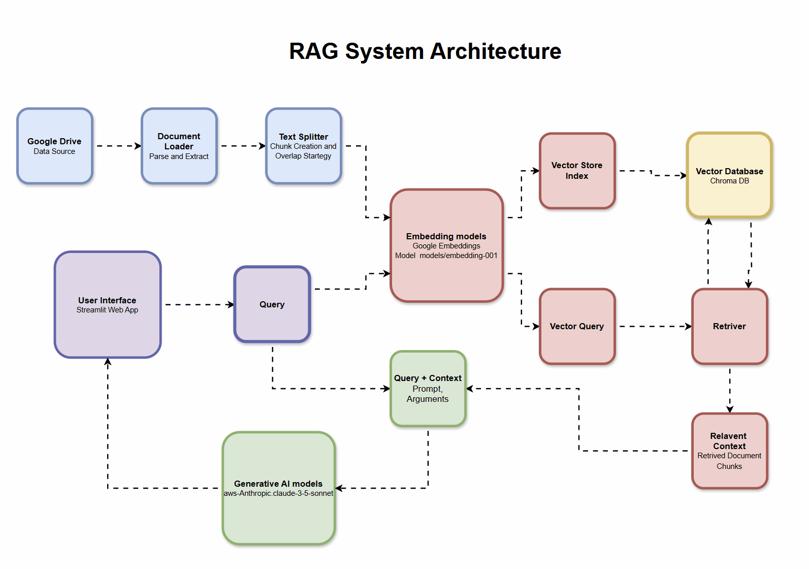

# 🚀 Google Drive RAG System

A powerful **Retrieval-Augmented Generation (RAG)** system that seamlessly integrates with Google Drive, enabling intelligent document querying and AI-powered responses using **Anthropic Claude**, **ChromaDB**, and **Google Embeddings**.


## ✨ Features

- 📁 **Google Drive Integration** - Direct document loading from Google Drive folders
- 🔍 **Intelligent Document Search** - Vector-based similarity search using ChromaDB
- 🤖 **AI-Powered Responses** - Context-aware responses using Anthropic Claude 3.5 Sonnet
- 📄 **PDF Processing** - Automated PDF parsing and text extraction
- 🌐 **Web Interface** - User-friendly Streamlit interface
- 💾 **Persistent Storage** - ChromaDB vector store with local persistence
- 🔄 **Real-time Processing** - Live document processing and querying

## 🏗️ System Architecture



### Architecture Components

| Component | Technology | Purpose |
|-----------|------------|---------|
| **Data Source** | Google Drive API | Document storage and access |
| **Document Loader** | LangChain GoogleDriveLoader | PDF parsing and extraction |
| **Text Chunking** | RecursiveCharacterTextSplitter | Document segmentation (1000 chars, 200 overlap) |
| **Embeddings** | Google Generative AI (embedding-001) | Vector representation generation |
| **Vector Database** | ChromaDB | Similarity search and storage |
| **Retrieval** | LangChain VectorStoreRetriever | Context-aware document retrieval |
| **Generation** | Anthropic Claude 3.5 Sonnet | AI response generation |
| **Interface** | Streamlit | Web-based user interface |

## 🛠️ Setup Instructions

### Prerequisites

- Python 3.8+
- Google Cloud Project with Drive API enabled
- Anthropic API access (via AWS Bedrock)
- Google AI API key

### 1. Clone Repository

```bash
git clone https://github.com/kamalkavin68/rag-system.git
cd rag-system
```

### 2. Install Dependencies

```bash
pip install -r requirements.txt
```

### 3. Environment Setup

Create a `.env` file in the root directory:

```env
# Google AI API Key
GOOGLE_API_KEY=your_google_api_key_here

# AWS Credentials for Anthropic Bedrock
AWS_ACCESS_KEY_ID=your_aws_access_key
AWS_SECRET_ACCESS_KEY=your_aws_secret_key
AWS_REGION=ap-southeast-2

#  Model configurations
EMBEDDING_MODEL=models/embedding-001
ANTHROPIC_MODEL=arn:aws:bedrock:ap-southeast-2:123367639755:inference-profile/apac.anthropic.claude-3-5-sonnet-20240620-v1:0
```

### 4. Google Drive Authentication

1. Create a Google Cloud Project
2. Enable Google Drive API
3. Create service account credentials
4. Download credentials JSON file
5. Place credentials as `secret/credentials.json`
6. Generate token file (will be created automatically on first run)

```bash
mkdir secret
# Place your credentials.json file in the secret folder
# Place your token.json file in the secret folder
```

### 5. Run Application

```bash
streamlit run main.py
```

### 6. Run Debug Mode

```bash
# Run with debug logging
streamlit run main.py --logger.level=debug
```


Navigate to `http://localhost:8501` in your browser.

## 📊 Performance Optimizations

### Current Optimizations

#### 🔧 **Document Processing**
- **Chunking Strategy**: 1000 character chunks with 200 character overlap for optimal context preservation
- **Batch Processing**: Efficient document loading and processing pipeline
- **Memory Management**: Session state management for persistent data

#### 🚀 **Vector Operations**
- **Similarity Search**: Top-K retrieval (K=4) for relevant context
- **Persistent Storage**: ChromaDB local persistence reduces reprocessing
- **Embedding Caching**: Google's embedding-001 model for consistent vectors

#### 🎯 **Response Generation**
- **Context Optimization**: Focused context injection for relevant responses
- **Token Management**: 5000 max tokens for comprehensive responses
- **Chat History**: Maintained conversation context for better continuity


## 💡 Usage Examples

### Basic Document Query

```python
# Example: Loading HR Policy Documents
folder_id = "1a2b3c4d5e6f7g8h9i0j"  # Your Google Drive folder ID
query = "What is the company's vacation policy?"

# Expected Response:
# "Based on the HR policy document, employees are entitled to 
# 15 days of paid vacation per year, with additional days 
# earned based on tenure..."
```


## 📈 Future Enhancements

- **Multi-format Support**: Word docs, PowerPoint, Excel files
    * Currently only processes PDF files. This would add support for other document formats.
- **Advanced Search**: Hybrid search combining dense and sparse retrieval
    * Combines two search methods for better results (like Dense retrieval and Sparse retrieval)
- **User Authentication**: Multi-user support with access controls
    * Allow multiple users with different access levels and personal chat histories.
- **Real-time Indexing**: Automatic document updates and re-indexing
    * Automatically detect when documents are added/modified in Google Drive and update the vector database.
- **Analytics Dashboard**: Usage statistics and performance metrics
    * Visual dashboard showing system usage, popular queries, response times, and user activity.
- **API Endpoints**: REST API for programmatic access
    * REST API allowing other applications to interact with your RAG system programmatically.

## 🙏 Acknowledgments

- [LangChain](https://langchain.com/) for the RAG framework
- [Anthropic](https://anthropic.com/) for Claude AI model
- [Google AI](https://ai.google/) for embedding models
- [Streamlit](https://streamlit.io/) for the web interface
- [ChromaDB](https://www.trychroma.com/) for vector storage

---


**Built with ❤️ and curiosity for AI innovation**

[⭐ Star this repo]( https://github.com/kamalkavin68/rag-system) | [🐛 Report Bug](https://github.com/kamalkavin68/rag-system/issues) | [💡 Request Feature](https://github.com/kamalkavin68/rag-system/issues)
